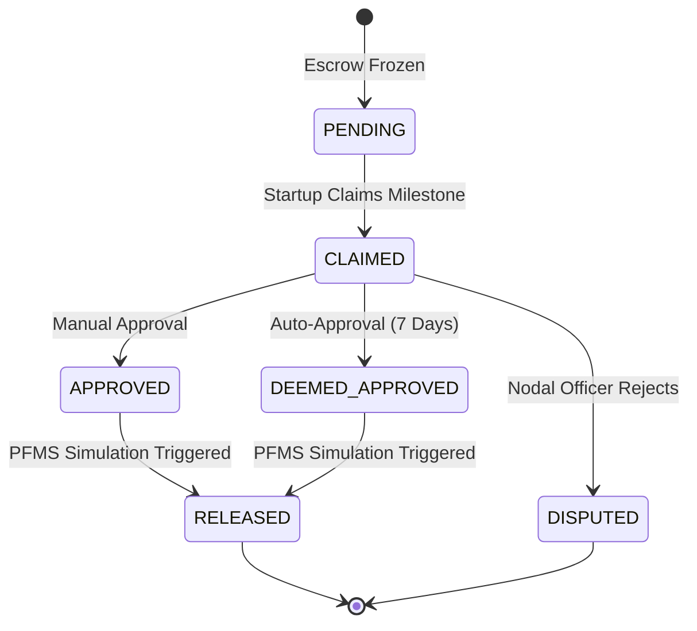
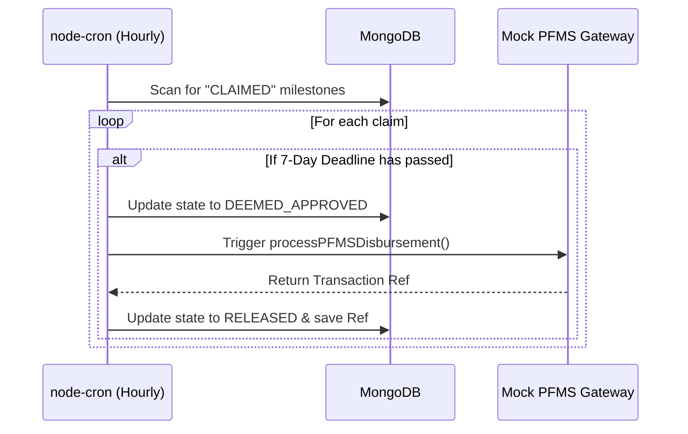

# 🏛️ GovInnovateBridge (Sahyog) - Backend API

> **Empowering Startups, Eliminating Red Tape.**
> Sahyog is a government startup funding platform designed to bring transparency, speed, and bureaucratic efficiency to B2G (Business-to-Government) interactions.

Welcome to the backend repository of Sahyog! This scalable Node.js API powers our two-envelope proposal parsing, ML-driven matchmaking, and simulated Smart Escrow disbursements.

---

## 🌟 Overview & Vision

Sahyog aims to bridge the gap between government bodies (Nodal Officers) and innovative Startups. Traditionally, government funding is slowed down by bureaucratic delays. Sahyog solves this by introducing **Smart Escrows** and **Automated Deemed-Approvals**. If a Nodal Officer fails to approve a valid milestone within 7 days, the system automatically steps in, approves it, and disburses the funds, protecting startups from unnecessary red tape.

---

## 🚀 Core Features

Here is a breakdown of the core systems driving the platform (including the latest features implemented by our team):

- **Secure JWT Authentication & Role-Based Access Control (RBAC)**: Fine-grained access for `STARTUP_FOUNDER`, `NODAL_OFFICER`, `JURY_MEMBER`, and `VIEWER`.
- **Escrow State Machine**: A highly secure financial tracking system for milestone claims (`PENDING` ➔ `CLAIMED` ➔ `APPROVED` / `DEEMED_APPROVED` ➔ `RELEASED`).
- **Automated 7-Day Deemed-Approval Watchdog**: A background cron job that automatically approves overdue milestones, ensuring startups get paid on time.
- **Mock PFMS Gateway**: Simulates instant financial disbursements to the Public Financial Management System.
- **Challenge Ingestion**: Government Nodal Officers can easily create and publish problem statements.
- **Two-Envelope Proposal System**: Startups submit proposals separated into a Technical Envelope (with ML PII masking for blind Jury evaluation) and a Financial Envelope (Vault encrypted).
- **ML Matchmaking & Auto-Reassignment**: Automatically assigns proposals to Jury members. A background job reassigns them if left unaccepted.
- **Two-Stage Weighted Evaluation (Phase 7)**: 
  - **Jury**: Scores out of 70 on Technical Criteria (Innovation, Feasibility, Scalability).
  - **Nodal Officer**: Scores out of 30 on Financial/Administrative Criteria (Budget, Timeline).
  - Backend automatically calculates the `(Jury/70 * 60) + (Officer/30 * 40)` formula and generates **Immutable Cryptographic Scorecards**.
- **Automated Top-3 Shortlisting**: Nodal Officers can fetch the top 3 highest-scoring proposals instantly.

---

## 🔄 Architecture & Workflows

### 1. 💰 Escrow State Machine Lifecycle

Our Smart Escrow system ensures secure transfers of trial budgets based on milestone completions. 



### 2. ⏳ Bureaucratic "Deemed-Approval" Automation

To prevent startups from being blocked by delays, our automated watchdog steps in after a deadline passes.



---

## 📡 API Reference

Our API is organized and secured. Below are the key endpoints:

### 🔑 Authentication
| Method | Endpoint | Required Role | Description |
| :--- | :--- | :--- | :--- |
| `POST` | `/api/auth/register` | *None* | Register a new user (`NODAL_OFFICER`, `STARTUP_FOUNDER`, etc.). |
| `POST` | `/api/auth/login` | *None* | Authenticate and retrieve JWT token. |
| `GET` | `/api/auth/me` | *Authenticated* | Retrieve the logged-in user's profile. |

### 💳 Escrows & Financials
| Method | Endpoint | Required Role | Description |
| :--- | :--- | :--- | :--- |
| `GET` | `/api/escrow/` | *Authenticated*| Fetch active escrows and milestone states. |
| `POST` | `/api/escrow/claim-milestone` | `STARTUP_FOUNDER` | Submit a claim for a completed milestone. |
| `POST` | `/api/escrow/approve` | `NODAL_OFFICER` | Manually approve a claimed milestone. |

### 🏦 Mock PFMS Gateway
| Method | Endpoint | Required Role | Description |
| :--- | :--- | :--- | :--- |
| `POST` | `/api/mock/pfms/disburse` | *Internal / Test* | Directly test the Mock PFMS disbursement logic. |

### 📝 Proposals & Grants
| Method | Endpoint | Required Role | Description |
| :--- | :--- | :--- | :--- |
| `POST` | `/api/proposals/submit` | `STARTUP_FOUNDER` | Submit a Two-Envelope proposal. |
| `PATCH` | `/api/proposals/:id/jury/accept` | `JURY_MEMBER` | Accept an ML-matched proposal assignment. |
| `PATCH` | `/api/proposals/:id/jury/decline` | `JURY_MEMBER` | Decline assignment (Triggers instant auto-reassign). |
| `GET` | `/api/proposals/challenge/:id`| `JURY_MEMBER` / `NODAL` | Fetch proposals (Envelope B locked for Jury). |
| `PATCH` | `/api/proposals/:id/evaluate` | `JURY_MEMBER` | Score proposal out of 70 (Generates Hash). |
| `PATCH` | `/api/proposals/:id/officer/evaluate` | `NODAL_OFFICER` | Score proposal out of 30 & calc final weight. |
| `POST` | `/api/proposals/:id/agreement/generate`| `NODAL_OFFICER` | Generate B2G Smart Escrow Agreement. |

### 🎯 Challenges & Discovery
| Method | Endpoint | Required Role | Description |
| :--- | :--- | :--- | :--- |
| `GET` | `/api/challenges/public` | *None* | Paginated listing of published challenges. |
| `POST` | `/api/challenges/create` | `NODAL_OFFICER` | Create a new challenge (auto-extracts KPIs). |
| `PATCH` | `/api/challenges/:id/shortlist-top-3` | `NODAL_OFFICER` | Shortlist Top 3 evaluated proposals automatically. |

---

## 🛠️ Getting Started / Setup Instructions

Follow these quick steps to get the backend running locally:

### 1. Prerequisites
- **Node.js** (v16+ recommended)
- **MongoDB** (Local instance or MongoDB Atlas)

### 2. Installation
Clone the repository and install the required dependencies:
```bash
npm install
```

### 3. Environment Variables
Create a `.env` file in the root backend directory:
```env
PORT=5000
MONGO_URI=mongodb://localhost:27017/govinnovatebridge
JWT_SECRET=your_super_secret_jwt_key
```

### 4. Running the Server
Start the development server with hot-reloading:
```bash
npm run dev
```
> The server will connect to MongoDB, boot up the background cron jobs, and expose the API on port `5000`.

### 5. Testing via Postman / cURL
You can easily test if the server is running by hitting the public challenge API:
```bash
curl -X GET http://localhost:5000/api/challenges/public
```
